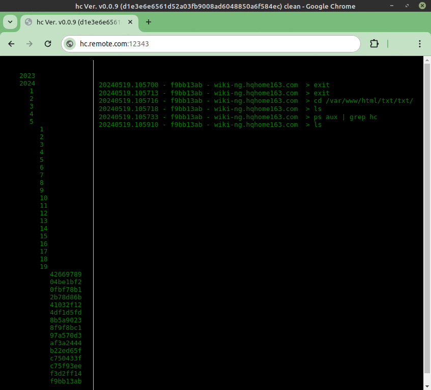

# HC History Collector
This is a simple Golang application designed to receive and store command
history data from remote clients. It listens for incoming connections using
the `net` package in Golang and accepts data in a simple text format.

When a client connects, the server reads the incoming data and prints it to
stdout.

This application is designed to be lightweight and easy to use, with a 
minimal set of dependencies and no external libraries required.

It can be compiled to run on any platform that is supported by Golang, 
including Windows, macOS, and Linux.

To get started with this application, simply download and compile the source
code.

## Start the server
The `hc` command requires at least two arguments:

* `-history`: Specifies the path to the text file that contains the raw log.
* `-tags`: Specifies the path to the JSON file that contains the tags the app
  searches for in the logs.
Example command:
```
./hc-<version> -history history.txt -tags tags.json &
```
Here is an example of a `tags.json` file:

```
{
  "RegexPrefix": "^[# ]*(sudo [ ]*){0,1}",
  "TagsList": [
    {"WPrefix": true, "Regex": "cd ", "TagStr": "directories"},
    {"WPrefix": true, "Regex": "mkdir ", "TagStr": "directories"},
    {"WPrefix": false, "Regex": "vnc", "TagStr": "vnc"}
  ]
}
```

* `RegexPrefix`: A regular expression that defines how to search for the tag.
  Its primary use is to find the command that has been invoked in the raw
  string. For example, if you use `sudo` for a command, you are not interested
  in the `sudo` command itself but the command that follows it.
* `TagsList`: A list of tags, each with:
    * `WPrefix`: Specifies if the Regex should be searched as a command 
      `true` or if it is plain text `false`.
    * `Regex`: The regular expression used to identify the tag.
* `TagStr`: A string that represents the tag to be searched.

## Search Capabilities
The server, other than just receiving the logs, now can also provide some
search capabilities. It can search in the text, **unique commands**, or **raw
log**. It can also search a single tag in the unique commands.
The search is available as raw text service bind at TCP service port.
To have a search result text, just send a formatted string to the service port
in the format: "cmd:text".

### Examples:
Search a tag in the unique commands list:
```
echo "tag:<tagname>" | nc hc.server.com 12344
```
Search the specified text in the unique commands list:
```
echo "text:<text>" | nc hc.server.com 12344
```
Search the specified text in the raw log:
```
echo "raw:<text>" | nc hc.server.com 12344
```
Search the last number of commands in the unique commands list:
```
echo "last:<number>" | nc hc.server.com 12344
```

### Compilation and Execution
To compile the application, use the included Makefile by simply typing:

```
make
```
Then, run the application with the necessary arguments:

```
./hc-<version> -history /path/to/history.txt -tags /path/to/tags.json
```

## Client setup
To send history data from a client:
```
export SESSIONID_=$(date +%Y%m%d.%H%M%S |sha1sum | sed -r 's/^(........).*/\1/')
export PROMPT_COMMAND='echo "$(date +%Y%m%d.%H%M%S) - ${SESSIONID_} - $(hostname --fqdn) > $(history -w /dev/stdout | tail -n1)"|nc hc.remote.com 12345'
```
These variables need to be set.
You can add them directly to `~/.bashrc` or set them at connection time.
```
ssh root@server.remote.com -t -R 12345:cmdlogger.remote.com:12345  'cmd=ZXhwb3J0IFNFU1NJT05JRF89JChkYXRlICslWSVtJWQuJUglTSVTIHxzaGExc3VtIHwgc2VkIC1yICdzL14oLi4uLi4uLi4pLiovXDEvJyk7IGV4cG9ydCBQUk9NUFRfQ09NTUFORD0nZWNobyAiJChkYXRlICslWSVtJWQuJUglTSVTKSAtICR7U0VTU0lPTklEX30gLSAkKGhvc3RuYW1lIC0tZnFkbikgPiAkKGhpc3RvcnkgLXcgL2Rldi9zdGRvdXQgfCB0YWlsIC1uMSkifG5jIDEyNy4wLjAuMSAxMjM0NSc7IGV4ZWMgYmFzaCAtaQoK ; eval $(echo $cmd|base64 -d)'
```

### HTTP-Based View
As of version 0.0.7, `hc` can provide an HTTP-based view of the command logs.
This view offers a web interface for navigating and viewing logs.


View logs via HTTP:
Open a browser and navigate to http://hc.server.com:12343
